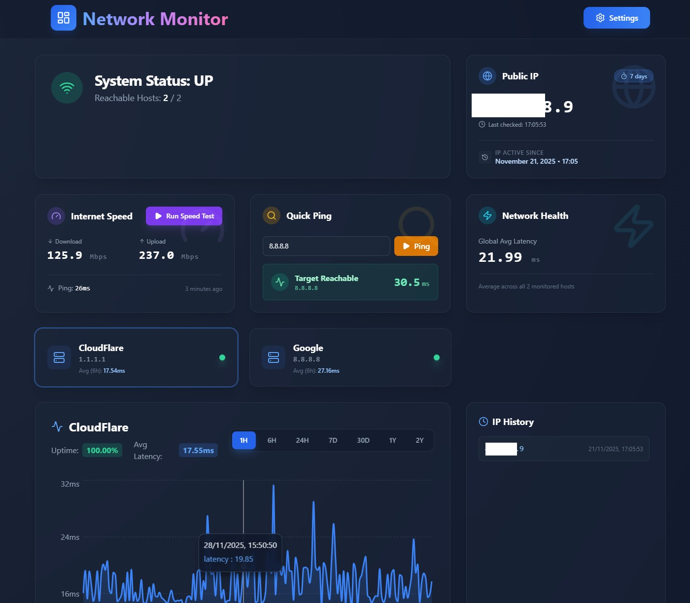

# Network Monitor

A modern, self-hosted network monitoring dashboard built with React, FastAPI, and InfluxDB. Monitor the uptime, latency, and status of your network devices in real-time with a premium, responsive user interface.

## 🚀 Features

*   **Real-time Monitoring**: Track latency and uptime for multiple hosts.
*   **Historical Data**: View interactive charts for latency trends over time (1h, 24h, 7d, 30d, 1y).
*   **Public IP Tracking**: Monitor your public IP address, view history of changes, and track duration of the current IP.
*   **Network Status**: Get an instant overview of your network health (UP/DOWN status based on reachable hosts).
*   **Host Management**: Add, edit, and delete hosts via a password-protected settings interface.
*   **Responsive Design**: "Premium" glassmorphism UI that looks great on desktop and mobile.
*   **Dockerized**: Easy deployment with Docker Compose.

## 🛠️ Tech Stack

*   **Frontend**: React, Vite, TailwindCSS, Recharts, Lucide React.
*   **Backend**: Python FastAPI, APScheduler.
*   **Database**: InfluxDB (Time Series Database).
*   **Containerization**: Docker, Docker Compose.

## 📋 Prerequisites

*   [Docker](https://www.docker.com/get-started) and Docker Compose installed on your machine.

## ⚡ Quick Start

1.  **Clone the repository** (or download the files):
    ```bash
    git clone <repository-url>
    cd network-monitor
    ```

2.  **Start the application**:
    ```bash
    docker-compose up -d --build
    ```

3.  **Access the Dashboard**:
    Open your browser and navigate to `http://localhost:3200` (or the port configured in `docker-compose.yml`).

## ⚙️ Configuration

### Docker Compose
You can configure ports and environment variables in `docker-compose.yml`.

| Service | Default Port | Description |
| :--- | :--- | :--- |
| **Frontend** | `3200` | The main dashboard UI. |
| **Backend** | `8100` | The API server (internal use mostly). |
| **InfluxDB** | `8086` | The database interface. |

### Environment Variables
*   `VITE_API_URL`: URL of the backend API (handled automatically by proxy in production).
*   `VITE_ADMIN_PASSWORD`: Password for the settings area (Default: `admin`). *Note: To change this in Docker, you must rebuild the image with build arguments.*

## 🖥️ Development

To run the project locally for development:

**1. Start Backend & Database:**
```bash
docker-compose up -d backend influxdb
```

**2. Start Frontend:**
```bash
cd frontend
npm install
npm run dev
```
The frontend will be available at `http://localhost:5173`.

## 📦 Deployment on Synology NAS

This project is optimized for deployment on Synology NAS using Container Manager.
See [DEPLOY_SYNOLOGY.md](./DEPLOY_SYNOLOGY.md) for detailed instructions.

# Network Monitor

A modern, self-hosted network monitoring dashboard built with React, FastAPI, and InfluxDB. Monitor the uptime, latency, and status of your network devices in real-time with a premium, responsive user interface.

## � Features

*   **Real-time Monitoring**: Track latency and uptime for multiple hosts.
*   **Historical Data**: View interactive charts for latency trends over time (1h, 24h, 7d, 30d, 1y).
*   **Public IP Tracking**: Monitor your public IP address, view history of changes, and track duration of the current IP.
*   **Network Status**: Get an instant overview of your network health (UP/DOWN status based on reachable hosts).
*   **Host Management**: Add, edit, and delete hosts via a password-protected settings interface.
*   **Responsive Design**: "Premium" glassmorphism UI that looks great on desktop and mobile.
*   **Dockerized**: Easy deployment with Docker Compose.

## 🛠️ Tech Stack

*   **Frontend**: React, Vite, TailwindCSS, Recharts, Lucide React.
*   **Backend**: Python FastAPI, APScheduler.
*   **Database**: InfluxDB (Time Series Database).
*   **Containerization**: Docker, Docker Compose.

## 📋 Prerequisites

*   [Docker](https://www.docker.com/get-started) and Docker Compose installed on your machine.

## ⚡ Quick Start

1.  **Clone the repository** (or download the files):
    ```bash
    git clone <repository-url>
    cd network-monitor
    ```

2.  **Start the application**:
    ```bash
    docker-compose up -d --build
    ```

3.  **Access the Dashboard**:
    Open your browser and navigate to `http://localhost:3200` (or the port configured in `docker-compose.yml`).

## ⚙️ Configuration

### Docker Compose
You can configure ports and environment variables in `docker-compose.yml`.

| Service | Default Port | Description |
| :--- | :--- | :--- |
| **Frontend** | `3200` | The main dashboard UI. |
| **Backend** | `8100` | The API server (internal use mostly). |
| **InfluxDB** | `8086` | The database interface. |

### Environment Variables
*   `VITE_API_URL`: URL of the backend API (handled automatically by proxy in production).
*   `VITE_ADMIN_PASSWORD`: Password for the settings area (Default: `admin`). *Note: To change this in Docker, you must rebuild the image with build arguments.*

## 🖥️ Development

To run the project locally for development:

**1. Start Backend & Database:**
```bash
docker-compose up -d backend influxdb
```

**2. Start Frontend:**
```bash
cd frontend
npm install
npm run dev
```
The frontend will be available at `http://localhost:5173`.

## 📦 Deployment on Synology NAS

This project is optimized for deployment on Synology NAS using Container Manager.
See [DEPLOY_SYNOLOGY.md](./DEPLOY_SYNOLOGY.md) for detailed instructions.

## �📝 License

This project is open source. Feel free to modify and distribute.

## Frontend preview


