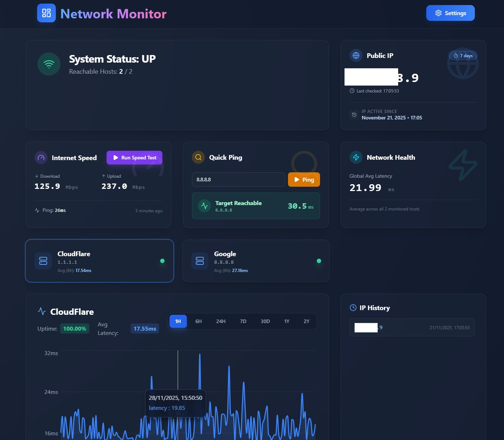

# Network Monitor

[](https://github.com/valhalla94/NetworkMonitor/actions/workflows/ci.yml)
[](https://github.com/valhalla94/NetworkMonitor/actions/workflows/codeql.yml)
[](https://github.com/valhalla94/NetworkMonitor/pkgs/container/networkmonitor-backend)
[](https://opensource.org/licenses/MIT)

A self-hosted, enterprise-grade network monitoring dashboard built with **React 19** and **FastAPI**. Monitor uptime, latency, and status of your network devices in real-time. Optimized for low-power devices like Synology NAS or Raspberry Pi.

---

## 🌟 GitHub Exemplar Repository Features

This repository implements all modern GitHub engineering standards and capabilities:
- 🛡️ **Automated SAST Security**: GitHub CodeQL static security analysis scanning on every push/PR.
- 📦 **Dependabot Dependency Management**: Weekly automated dependency updates for `pip`, `npm`, and `github-actions`.
- 🐳 **GitHub Container Registry (GHCR)**: Automatic multi-arch Docker image builds pushed to `ghcr.io`.
- ⚡ **CI/CD Concurrency & Job Summaries**: Automated test runs with concurrency cancellation and rich markdown summaries.
- 📝 **Interactive Issue Forms**: Structured YAML issue templates for bugs and feature proposals.
- 📜 **Open Source Governance**: Includes `SECURITY.md`, `CONTRIBUTING.md`, `CODE_OF_CONDUCT.md`, and `LICENSE`.

---

## Features

- **Real-time Monitoring**: Latency and uptime for multiple hosts (ICMP/Ping, HTTP, TCP) via Server-Sent Events
- **Smart Notifications**: Alerts via Discord, Telegram, Email, and more when a host goes DOWN or UP. Powered by **Apprise**
- **Internet Speed Test**: Built-in speed test (Download, Upload, Ping) with historical tracking
- **Quick Ping**: Instantly ping any IP or hostname without adding it to the monitor
- **Network Health**: Global average latency across all monitored hosts
- **Public IP Tracking**: Monitor public IP address and view change history
- **Historical Charts**: Interactive latency charts (1h, 24h, 7d, 30d, 1y). Data retained 30 days
- **SSL Certificate Monitoring**: Alerts when certificates are about to expire
- **Host Management**: Add, edit, and delete hosts via a JWT-authenticated settings interface
- **Dark/Light Theme**: Toggle between themes with persistent preference
- **Audit Log**: Track all configuration changes
- **Responsive Design**: Glassmorphism UI, works on desktop and mobile
- **Dockerized**: Single `docker-compose up` deployment

---

## Tech Stack

| Layer | Technology |
| :--- | :--- |
| **Frontend** | React 19, Vite 7, TailwindCSS 3, Recharts 3, React Router 7 |
| **Backend** | Python 3.11, FastAPI 0.109, APScheduler 3.10, SQLAlchemy 2 |
| **Auth** | JWT (python-jose), bcrypt, rate limiting (slowapi) |
| **Database** | SQLite with WAL mode |
| **Notifications** | Apprise |
| **Deploy** | Docker Compose, Nginx reverse proxy |

---

## Quick Start

**Prerequisites**: Docker and Docker Compose installed.

1. Clone the repository:
   ```bash
   git clone https://github.com/valhalla94/NetworkMonitor.git
   cd NetworkMonitor
   ```

2. Set required environment variables (create a `.env` file):
   ```bash
   SECRET_KEY=$(python3 -c "import secrets; print(secrets.token_hex(32))")
   ADMIN_PASSWORD=your-strong-password
   FRONTEND_ORIGIN=http://localhost:3200
   ```

3. Start the application:
   ```bash
   docker-compose up -d --build
   ```

4. Open `http://localhost:3200` in your browser.

---

## Configuration

### Environment Variables

Set these in your `.env` file or `docker-compose.yml` environment section:

| Variable | Required | Description |
| :--- | :--- | :--- |
| `SECRET_KEY` | **Yes** | JWT signing key. Generate: `python3 -c "import secrets; print(secrets.token_hex(32))"` |
| `ADMIN_PASSWORD` | **Yes** | Dashboard login password. Default `admin` — change before production |
| `FRONTEND_ORIGIN` | No | CORS origin for the frontend. Default: `http://localhost:3200` |

---

## Development & Contributing

See [CONTRIBUTING.md](./CONTRIBUTING.md) for full development environment setup, testing procedures, and code formatting guidelines.

```bash
# Backend Tests & Linting
cd backend
ruff check .
pytest tests/ -v

# Frontend Tests & Linting
cd frontend
npm run lint
npm run test
```

---

## Security

See [SECURITY.md](./.github/SECURITY.md) for vulnerability disclosure details.

---

## Deployment on Synology NAS

See [DEPLOY_SYNOLOGY.md](./DEPLOY_SYNOLOGY.md) for detailed instructions.

---

## License

Released under the [MIT License](./LICENSE).

---

## Preview


